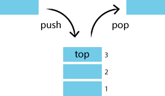

# 1. Stack
## 1.1 스택의 개념
    후입선출 (LIFO, Last In First Out) 방식
<br/>
<p align="center"></img></p>

<br/>

## 1.2 스택의 특징
    - 정해진 방향으로만 쌓을 수 있으며 top 으로 정한 곳을 통해서만 접근 가능

    - 삽입되는 자료는 top이 가리키는 자료의 위에 쌓이게 되며 스택에서 자료를 삭제할 때도 top을 통해서만 가능
<br/>

## 1.3 스택의 장/단점
    - top 을 통해 접근하기 때문에 데이터 접근, 삽입, 삭제가 빠름

    - top 위치 이외의 데이터에 접근할 수 없기 때문에 탐색이 불가능하고, 탐색하려면 모든 데이터를 꺼내면서 진행해야 함
<br/>

## 1.4 스택의 연산
    - pop(): 스택의 가장 위에 있는 항목을 반환 및 제거

    - push(value): value 를 스택의 가장 윗 부분에 추가

    - peek(): 스택의 가장 위에 있는 항목을 반환

    - isEmpty(): 스택이 비어 있을 때 true 를 반환
<br/>

## 1.5 스택의 사용방법
```java
Stack stack = new Stack();
stack.push(1);
stack.push(3);
stack.push(5);
System.out.println(stack.pop());    //5반환
```
<br/>
<br/>
<br/>

# 2. Queue
## 2.1 큐의 개념
    선입선출 (FIFO, First in first out) 방식

<br/>
<p align="center"></img></p>

<br/>

## 2.2 큐의 특징
    - 한쪽 끝에서 삽입, 다른 쪽 끝에서는 삭제가 이루어짐

    - 리어에서 이루어지는 삽입 연산을 인큐(Enqueue)라 부르며 프론트에서 이루어지는 삭제 연산을 디큐(Dequeue)라고 부름
<br/>

## 2.3 큐의 장/단점
    - 데이터 접근, 삽입, 삭제가 빠름
    
    - 큐 역시 스택과 마찬가지로 중간에 위치한 데이터에 대한 접근이 불가능
<br/>

## 2.4 큐의 연산
    - add(value), offer(value): Enqueue(삽입)하는 메서드

    - remove(), poll(): Dequeue(삭제)하는 메서드 
    
    - element(), peek(): 맨 앞에 있는 요소를 꺼내는 메서드 

    ※ add(value), remove(), element() 와 offer(value), poll(), peek()의 차이점은?
    → 예외를 발생시키는가 아니면 null이나 false를 반환하는가!!
<br/>

## 2.5 큐의 사용방법
```java
Queue queue = new LinkedList<>();

queue.add(1);
queue.offer(2);

//현재 queue에는 1,2가 담겨있음

queue.remove();     //1꺼내짐
queue.poll();       //2꺼내짐

queue.element();    //큐가 비어서 예외 발생
queue.peek();       //큐가 비어서 null 반환
```